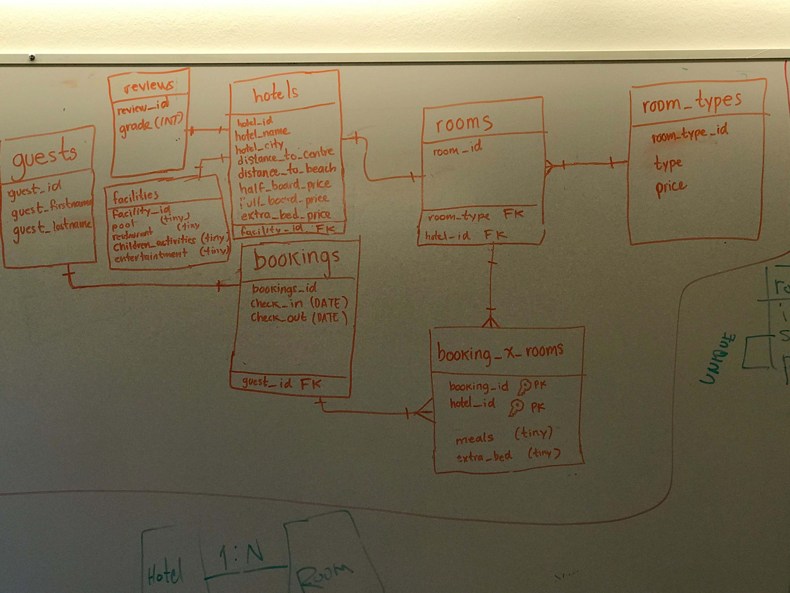
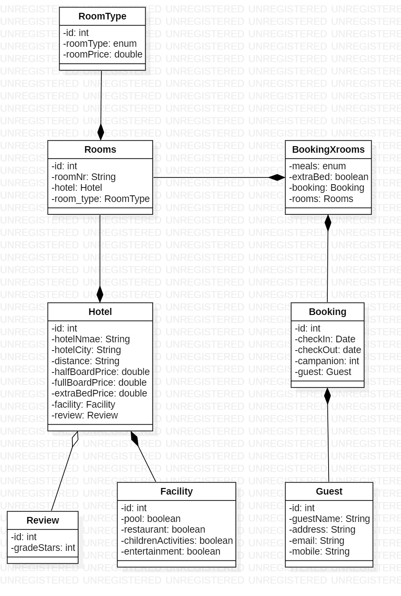

# Holidaymaker
 A java console tool where admin can book accommodation for guests through MySQL.
 
In the beginning, i worked with my team to draw the relational entities diagram, then I continued by my self 
to build real EER, UML, database and java console.
I create all the classes that match the tables, so in the future, I can continue coding to have a complete application.

